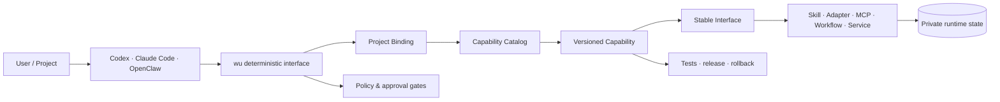

# Two-Headed-Wu / 两头乌

Two-Headed-Wu is a deterministic capability infrastructure for AI coding agents. It organizes
reusable capabilities, stable interfaces, project bindings, permission boundaries, releases, and
recovery without asking a language model to make authorization decisions.

两头乌是一套面向 AI 编程 Agent 的确定性能力基础设施。它负责组织可复用能力、稳定接口、
项目绑定、权限边界、版本与恢复流程，但不让语言模型自行决定权限。

> This repository is the public architecture showcase. Private runtime state, credentials,
> personal data, deployment topology, and owner-specific configuration are intentionally excluded.

## Architecture

The system follows four ownership boundaries:

- **Core** — deterministic commands, validation, routing, and policy enforcement.
- **Catalog** — indexes, versions, bindings, and resource references.
- **Capabilities** — independently testable and versioned delivery units.
- **Var** — generated state, caches, logs, and machine-local data outside source control.

## What this project demonstrates

- Capability-first composition instead of a large global prompt.
- Stable, versioned interfaces across different Agent runtimes.
- Least-privilege project bindings and explicit approval gates.
- Separation of public source from private data and machine state.
- Reproducible releases, health checks, rollback, and generated documentation.
- Spec-driven changes with automated Git and acceptance gates.

## Public roadmap

- Refine this architecture overview and publish a minimal runnable core.
- Publish selected capabilities as independent repositories.
- Add an end-to-end demonstration and reproducible examples.

The README is intentionally concise while the public edition is being prepared.
