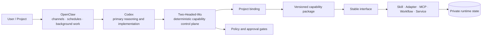

# Two-Headed-Wu / 两头乌

Two-Headed-Wu is a deterministic capability layer for AI agents. It gives Codex and other
reasoning runtimes a stable way to discover, authorize, invoke, test, and recover reusable
capabilities without turning a model prompt into the system's source of truth.

两头乌是一套面向 AI Agent 的确定性能力基础设施：以 Codex 为主要智能执行器，以
OpenClaw 承担常驻渠道、定时任务与后台运行，并通过可版本化的能力包实现扩展、维护与解耦。

> This is the curated public reference edition. It explains the real architecture and includes a
> runnable capability-authoring example, but excludes the owner's private catalog, credentials,
> data, deployment topology, runtime state, and unpublished capabilities.

## Why it exists

AI agents are good at interpreting intent, but durable infrastructure should not depend on a model
remembering paths, guessing permissions, or reconstructing deployment state. Two-Headed-Wu keeps
those decisions in deterministic declarations and exposes only the interfaces allowed for the
current project and runtime.



OpenClaw is the operational shell for the complete personal system; Codex is its primary reasoning
engine; Two-Headed-Wu is the deterministic layer that knows what exists, what is allowed, and how a
capability is invoked. None of the three should silently absorb the responsibilities of the other
two. See [Runtime roles](docs/runtime-roles.md) for the precise boundary.

## What you can do with this repository

| Goal | Codex required? | OpenClaw required? | Available here? |
|---|---:|---:|---:|
| Read and review the architecture | No | No | Yes |
| Create and validate a capability package | No; recommended | No | Yes |
| Run the included hello capability | No | No | Yes |
| Use persistent channels, schedules, and background sessions | No | Yes | Integration guide only |
| Reproduce the owner's complete private system | Yes | Yes | No, intentionally |

The public repository is therefore useful without OpenClaw, while the complete Two-Headed-Wu
experience is intentionally OpenClaw-dependent. Start with the [OpenClaw integration guide](docs/openclaw-setup.md)
before attempting a full runtime deployment.

## Quick start

Ruby 2.6 or newer is sufficient for the public example; no gems are required.

```bash
git clone https://github.com/gyy489/two-head-wu.git
cd two-head-wu
ruby tools/validate-capability examples/hello-capability/capability.yaml
examples/hello-capability/tests/test_hello.sh
examples/hello-capability/adapters/hello --name Codex
```

Expected final output:

```json
{"message":"Hello, Codex!","interface":"hello.greet.v1"}
```

To make your own package, copy `examples/hello-capability/`, change its stable identifiers and
implementation, then follow [Build a capability](docs/build-a-capability.md).

## Architecture at a glance

Two-Headed-Wu separates four kinds of ownership:

- **Core** — deterministic discovery, validation, routing, and policy enforcement.
- **Catalog** — package indexes, project bindings, versions, and external resource references.
- **Capabilities** — independently testable, versioned, and recoverable delivery units.
- **Var** — generated state, caches, logs, and machine-local data kept outside source control.

A capability package may contain Skills, adapters, MCP servers, workflows, services, agents, and
tests, but callers depend only on a stable Capability ID and Interface ID. The package manifest is
the source of truth for versions, dependencies, permissions, compatibility, tests, and recovery.

```text
Project + Agent + Runtime + Intent
                │
                ▼
       deterministic resolution
                │
                ▼
Binding → Capability version → Allowed interface → Execution → Evidence / recovery
```

Discovery never grants authorization. Optional providers must degrade explicitly. Cross-package
dependencies must be declared, directional, acyclic, testable, and replaceable.

## Repository map

```text
.
├── docs/                   architecture, runtime roles, authoring, and security
├── schemas/                public machine-readable contracts
├── examples/
│   ├── capability.yaml     manifest-shaped reference
│   ├── project-binding.yaml
│   ├── deployment-profile.yaml
│   └── hello-capability/   runnable capability package
├── tools/
│   └── validate-capability deterministic local validator
└── .github/workflows/      automated public checks
```

## Documentation

- [Architecture](docs/architecture.md) — components, resolution path, lifecycle, and boundaries.
- [Runtime roles](docs/runtime-roles.md) — OpenClaw, Codex, and Two-Headed-Wu responsibilities.
- [Capability model](docs/capability-model.md) — package contract and decoupling rules.
- [Build a capability](docs/build-a-capability.md) — a concrete authoring workflow.
- [OpenClaw setup](docs/openclaw-setup.md) — prerequisites and integration contract.
- [Security boundary](docs/security-boundary.md) — what may and may not enter a public package.

## Public/private boundary

This repository contains architecture, sanitized contracts, deterministic tooling, generated
fixtures, and a harmless example. It does not contain private memory, conversations, credentials,
account bindings, machine paths, deployment targets, logs, or the complete capability catalog.
Selected production capabilities may be released separately after they can be independently
tested and reviewed against this boundary.

## License

MIT. See [LICENSE](LICENSE).
