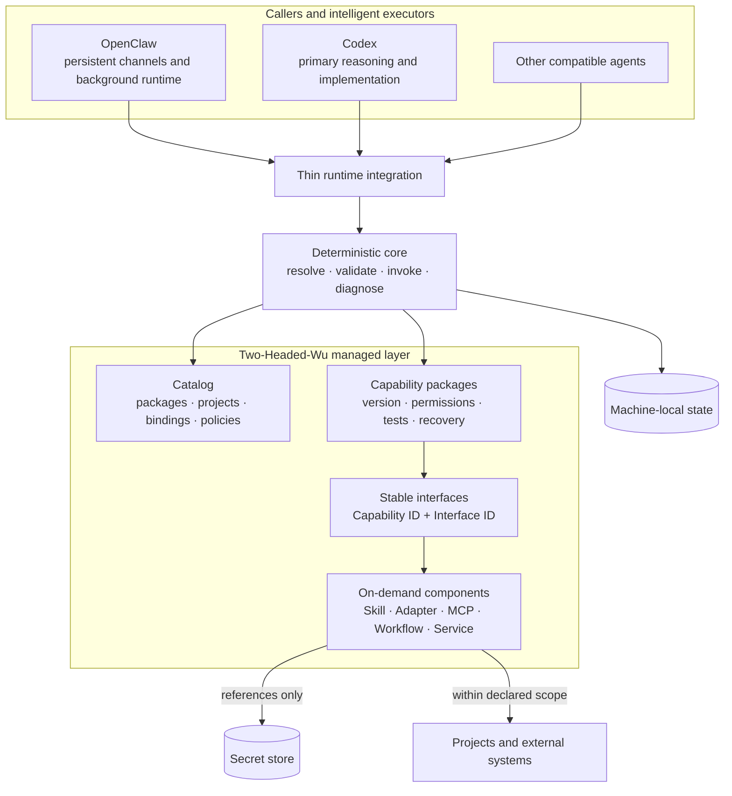
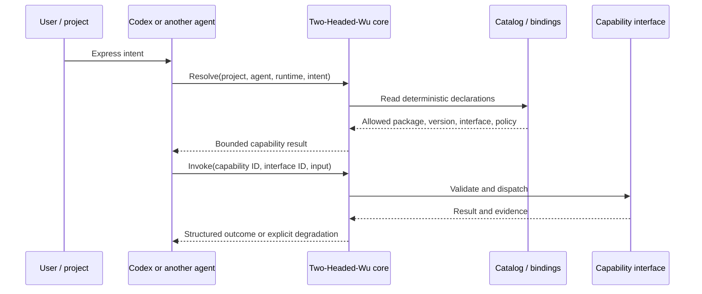

# Architecture

## Positioning

Two-Headed-Wu is not a model and is not an OpenClaw replacement. It is a deterministic control
plane between intelligent executors and reusable capabilities. The model interprets the user's
goal; Two-Headed-Wu resolves declared facts such as project scope, compatible versions, allowed
interfaces, permissions, and recovery behavior.

Its central rule is:

> Two-Headed-Wu knows what exists, where it is, who may use it, and how it is invoked. Original
> data and secrets remain in their appropriate systems of record.

## System context



The integration layer is deliberately thin. Finding the tool or loading its instructions does not
authorize execution; the deterministic core still evaluates the project binding and requested
interface.

## Four ownership areas

### Core

Core owns mechanical operations: parse declarations, resolve bindings, validate graphs, select
compatible versions, enforce policies, invoke registered interfaces, and emit diagnostics. Core
does not contain optional business logic and does not ask a model to infer authorization.

### Catalog

Catalog is the map, not the territory. It records package releases, project bindings, policies,
resource references, and deployment profiles. A catalog may contain a secret reference such as
`env://EXAMPLE_TOKEN`; it must never contain the secret value.

### Capabilities

A capability is the unit of delivery and recovery. It may own several implementation components,
but exposes them through named interfaces. Each package has an independent version, test surface,
permission declaration, and rollback story.

### Var

Runtime state—logs, caches, generated indexes, active-version pointers, reports, and local
bindings—belongs outside reproducible source. The public repository excludes this area by design.

## Resolution and execution



Resolution and invocation are separate. Installation, discovery, or model awareness does not grant
permission. Invocation succeeds only when package identity, interface, runtime compatibility,
project binding, requested data scope, and approval policy all match.

## Package lifecycle

```text
author → validate → test → review permissions → release → bind to project → invoke
                                                          │
                                                          └→ diagnose / rollback
```

A release should be immutable. Projects bind to an exact or compatible range according to an
explicit update policy. A failed candidate must not replace a working active version. Rollback
switches to a previously verified release instead of attempting to reconstruct one from memory.

## Decoupling constraints

- Cross-package calls use stable Capability IDs and Interface IDs, not private source paths.
- Core never depends on optional channel, device, business, or data-provider implementations.
- The manifest is the package-local source of truth.
- Shared components retain one authoritative source and are referenced instead of copied.
- Optional dependencies report an explicit unavailable or degraded state.
- The capability dependency graph must be acyclic.
- Secrets, personal data, account bindings, and mutable state live outside package source.

These constraints make packages independently testable, releasable, replaceable, and removable.

## What this public edition proves

The repository exposes the architecture, schemas, authoring workflow, a deterministic manifest
validator, and a runnable package. It demonstrates the contract and development loop. It does not
claim to reproduce the private catalog, complete resolver, OpenClaw installation, or owner-specific
runtime.
